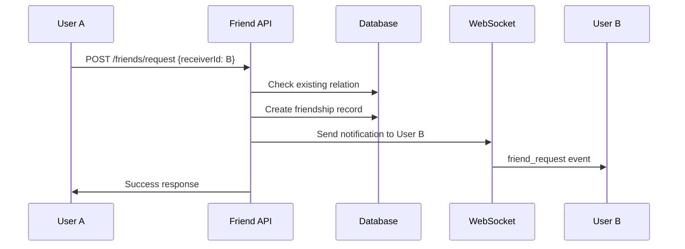
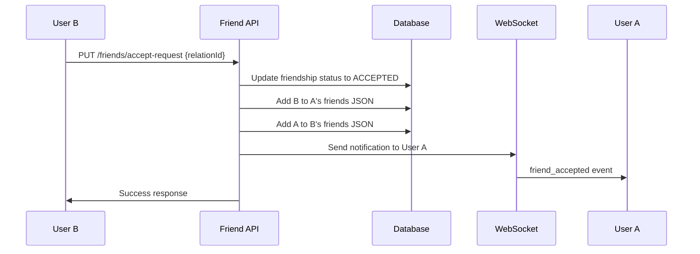

# Friend System API

친구 요청, 수락, 삭제 등의 친구 관계 관리를 위한 API입니다.

## 📋 목차

- [인증](#인증)
- [API 엔드포인트](#api-엔드포인트)
- [에러 코드](#에러-코드)
- [데이터 모델](#데이터-모델)
- [사용 예시](#사용-예시)

## 🔐 인증

모든 API는 JWT 토큰을 통한 인증이 필요합니다.

```http
Authorization: Bearer YOUR_JWT_TOKEN
```

## 🔗 API 엔드포인트

### Base URL

```
/v1/friends
```

### 1. 친구 요청 보내기

**Endpoint:** `POST /request`

친구 요청을 보냅니다.

**Request Body:**

```json
{
  "receiverId": 2
}
```

**Response:**

```json
{
  "success": true,
  "data": {
    "message": "Friend request sent successfully"
  }
}
```

**Error Response:**

```json
{
  "success": false,
  "error": {
    "code": "BAD_REQUEST",
    "message": "Friend request already exists"
  }
}
```

---

### 2. 친구 요청 수락

**Endpoint:** `PUT /accept-request`

받은 친구 요청을 수락합니다.

**Request Body:**

```json
{
  "relationId": "1"
}
```

**Response:**

```json
{
  "success": true,
  "data": {
    "message": "Friend request accepted successfully"
  }
}
```

---

### 3. 친구 삭제

**Endpoint:** `DELETE /delete/:relationId`

친구 관계를 삭제합니다.

**Path Parameters:**

- `relationId` (number): 친구 관계 ID

**Response:**

```json
{
  "success": true,
  "data": {
    "message": "Friend deleted successfully"
  }
}
```

---

### 4. 친구 목록 조회

**Endpoint:** `GET /list`

현재 사용자의 친구 목록을 조회합니다.

**Query Parameters:**

- `page` (number, optional): 페이지 번호 (기본값: 1)
- `size` (number, optional): 페이지 크기 (기본값: 10)

**Response:**

```json
{
  "success": true,
  "data": {
    "friends": [
      {
        "id": 2,
        "username": "john_doe",
        "nickname": "John",
        "profile_image": "/uploads/profiles/john.jpg",
        "status": "ONLINE",
        "total_wins": 15,
        "total_loses": 8,
        "win_rate": 65.2,
        "updated_at": "2025-07-20T10:30:00.000Z"
      },
      {
        "id": 3,
        "username": "jane_smith",
        "nickname": "Jane",
        "profile_image": null,
        "status": "OFFLINE",
        "total_wins": 22,
        "total_loses": 12,
        "win_rate": 64.7,
        "updated_at": "2025-07-20T09:15:00.000Z"
      }
    ]
  }
}
```

---

### 5. 받은 친구 요청 조회

**Endpoint:** `GET /received-requests`

현재 사용자가 받은 친구 요청 목록을 조회합니다.

**Query Parameters:**

- `page` (number): 페이지 번호 (기본값: 1)
- `size` (number): 페이지 크기 (기본값: 10)

**Response:**

```json
{
  "success": true,
  "data": {
    "content": [
      {
        "id": 1,
        "sender_id": 2,
        "receiver_id": 1,
        "status": "PENDING",
        "created_at": "2025-07-20T10:00:00.000Z",
        "user": {
          "id": 2,
          "username": "john_doe",
          "nickname": "John",
          "profile_image": "/uploads/profiles/john.jpg"
        }
      }
    ]
  }
}
```

---

### 6. 보낸 친구 요청 조회

**Endpoint:** `GET /sent-requests`

현재 사용자가 보낸 친구 요청 목록을 조회합니다.

**Query Parameters:**

- `page` (number): 페이지 번호 (기본값: 1)
- `size` (number): 페이지 크기 (기본값: 20)

**Response:**

```json
{
  "success": true,
  "data": {
    "content": [
      {
        "id": 2,
        "sender_id": 1,
        "receiver_id": 3,
        "status": "PENDING",
        "created_at": "2025-07-20T11:00:00.000Z",
        "user": {
          "id": 3,
          "username": "mike_wilson",
          "nickname": "Mike",
          "profile_image": null
        }
      }
    ]
  }
}
```

---

### 7. 친구 요청 거절

**Endpoint:** `DELETE /reject-request`

받은 친구 요청을 거절합니다.

**Request Body:**

```json
{
  "relationId": "1"
}
```

**Response:**

```json
{
  "success": true,
  "data": {
    "message": "Friend request rejected successfully"
  }
}
```

---

### 8. 친구 요청 취소

**Endpoint:** `DELETE /cancel-request/:receiverId`

보낸 친구 요청을 취소합니다.

**Path Parameters:**

- `receiverId` (number): 요청을 받은 사용자 ID

**Response:**

```json
{
  "success": true,
  "data": {
    "message": "Friend request cancelled successfully"
  }
}
```

---

## ❌ 에러 코드

| 코드           | 설명                                               |
| -------------- | -------------------------------------------------- |
| `BAD_REQUEST`  | 잘못된 요청 (필수 파라미터 누락, 잘못된 데이터 등) |
| `UNAUTHORIZED` | 인증 실패                                          |
| `FORBIDDEN`    | 권한 없음                                          |
| `NOT_FOUND`    | 리소스를 찾을 수 없음                              |

## 📊 데이터 모델

### User

```typescript
interface User {
  id: number;
  username: string;
  nickname: string;
  profile_image: string | null;
  status: "ONLINE" | "OFFLINE" | "PLAYING";
  total_wins: number;
  total_loses: number;
  win_rate: number;
  updated_at: string;
}
```

### Friendship

```typescript
interface Friendship {
  id: number;
  sender_id: number;
  receiver_id: number;
  status: "PENDING" | "ACCEPTED";
  created_at: string;
  updated_at: string;
  user?: User; // include된 경우에만
}
```

## 🎮 사용 예시

### 친구 요청 흐름

1. **친구 요청 보내기**

```javascript
// POST /v1/friends/request
const response = await fetch("/v1/friends/request", {
  method: "POST",
  headers: {
    Authorization: "Bearer YOUR_TOKEN",
    "Content-Type": "application/json",
  },
  body: JSON.stringify({
    receiverId: 2,
  }),
});
```

2. **받은 요청 확인**

```javascript
// GET /v1/friends/received-requests
const requests = await fetch("/v1/friends/received-requests", {
  headers: {
    Authorization: "Bearer YOUR_TOKEN",
  },
});
```

3. **친구 요청 수락**

```javascript
// PUT /v1/friends/accept-request
const acceptance = await fetch("/v1/friends/accept-request", {
  method: "PUT",
  headers: {
    Authorization: "Bearer YOUR_TOKEN",
    "Content-Type": "application/json",
  },
  body: JSON.stringify({
    relationId: "1",
  }),
});
```

4. **친구 목록 확인**

```javascript
// GET /v1/friends/list
const friends = await fetch("/v1/friends/list", {
  headers: {
    Authorization: "Bearer YOUR_TOKEN",
  },
});
```

## 🔔 WebSocket 알림

친구 시스템에서는 실시간 알림을 위해 WebSocket을 사용합니다.

### 친구 요청 이벤트

```javascript
// 네임스페이스: 'friend'
// 이벤트: 'friend_request'

// 친구 요청 받음
{
  type: "request",
  payload: {
    relationId: 1,
    message: "You have a new friend request"
  }
}

// 친구 요청 수락됨
{
  type: "accepted",
  payload: {
    message: "Friend request accepted",
    relationId: 1,
    userId: 2
  }
}

// 친구 요청 거절됨
{
  type: "rejected",
  payload: {
    message: "Friend request rejected",
    relationId: 1,
    userId: 2
  }
}

// 친구 요청 취소됨
{
  type: "cancelled",
  payload: {
    message: "Friend request cancelled",
    relationId: 1,
    userId: 2
  }
}
```

## 📱 프론트엔드 연동 예시

### React Hook 예시

```javascript
import { useState, useEffect } from "react";

const useFriends = () => {
  const [friends, setFriends] = useState([]);
  const [receivedRequests, setReceivedRequests] = useState([]);
  const [loading, setLoading] = useState(false);

  const fetchFriends = async () => {
    setLoading(true);
    try {
      const response = await fetch("/v1/friends/list", {
        headers: { Authorization: `Bearer ${token}` },
      });
      const data = await response.json();
      setFriends(data.data.friends);
    } catch (error) {
      console.error("Failed to fetch friends:", error);
    } finally {
      setLoading(false);
    }
  };

  const sendFriendRequest = async (receiverId) => {
    try {
      await fetch("/v1/friends/request", {
        method: "POST",
        headers: {
          Authorization: `Bearer ${token}`,
          "Content-Type": "application/json",
        },
        body: JSON.stringify({ receiverId }),
      });
      // 성공 처리
    } catch (error) {
      console.error("Failed to send friend request:", error);
    }
  };

  const acceptFriendRequest = async (relationId) => {
    try {
      await fetch("/v1/friends/accept-request", {
        method: "PUT",
        headers: {
          Authorization: `Bearer ${token}`,
          "Content-Type": "application/json",
        },
        body: JSON.stringify({ relationId: relationId.toString() }),
      });
      // 친구 목록 및 요청 목록 새로고침
      fetchFriends();
      fetchReceivedRequests();
    } catch (error) {
      console.error("Failed to accept friend request:", error);
    }
  };

  return {
    friends,
    receivedRequests,
    loading,
    sendFriendRequest,
    acceptFriendRequest,
    fetchFriends,
  };
};
```

## 🧪 테스트

### cURL 테스트 예시

```bash
# 친구 요청 보내기
curl -X POST "http://localhost:3333/v1/friends/request" \
  -H "Authorization: Bearer YOUR_TOKEN" \
  -H "Content-Type: application/json" \
  -d '{"receiverId": 2}'

# 친구 목록 조회
curl -X GET "http://localhost:3333/v1/friends/list" \
  -H "Authorization: Bearer YOUR_TOKEN"

# 친구 요청 수락
curl -X PUT "http://localhost:3333/v1/friends/accept-request" \
  -H "Authorization: Bearer YOUR_TOKEN" \
  -H "Content-Type: application/json" \
  -d '{"relationId": "1"}'
```

## 📈 성능 고려사항

- 친구 목록은 JSON 필드로 캐싱되어 빠른 조회가 가능합니다
- 페이지네이션을 통해 대량의 데이터도 효율적으로 처리합니다
- WebSocket을 통한 실시간 알림으로 사용자 경험이 향상됩니다

## 🔧 구현 세부사항

- **데이터베이스**: SQLite with Prisma ORM
- **캐싱**: User.friends JSON 필드 활용
- **실시간 통신**: WebSocket (Socket.IO)
- **페이지네이션**: Offset-based pagination
- **에러 처리**: 통합 에러 핸들링 시스템

# Friend System Technical Documentation

## 🏗️ 아키텍처 개요

친구 시스템은 다음과 같은 계층 구조로 구현됩니다:

```
┌─────────────────┐
│   friendRoutes  │ <- HTTP 라우팅
├─────────────────┤
│ friendController│ <- 요청/응답 처리
├─────────────────┤
│  friendService  │ <- 비즈니스 로직
├─────────────────┤
│   friendRepo    │ <- 데이터 접근
└─────────────────┘
```

## 🗃️ 데이터베이스 스키마

### Friendship 테이블

```sql
CREATE TABLE Friendship (
  id INTEGER PRIMARY KEY AUTOINCREMENT,
  sender_id INTEGER NOT NULL,
  receiver_id INTEGER NOT NULL,
  status TEXT NOT NULL DEFAULT 'PENDING',
  created_at DATETIME DEFAULT CURRENT_TIMESTAMP,
  updated_at DATETIME DEFAULT CURRENT_TIMESTAMP,
  UNIQUE(sender_id, receiver_id),
  FOREIGN KEY (sender_id) REFERENCES User(id),
  FOREIGN KEY (receiver_id) REFERENCES User(id)
);
```

### User.friends 필드

```json
// JSON 문자열로 저장되는 친구 ID 배열
"[1, 3, 5, 7, 9]"
```

## 🔧 핵심 컴포넌트

### 1. FriendRepo (Data Layer)

```javascript
class FriendRepo {
  // 친구 요청 생성
  async requestFriend(friendId, userId)

  // 친구 요청 수락
  async acceptFriendRequest(relationId)

  // 친구 관계 삭제
  async deleteFriend(relationId)

  // 친구 관계 조회
  async findRelation(senderId, receiverId)

  // 받은/보낸 요청 목록
  async getReceivedRequests(userId, pageable)
  async getSentRequests(userId, pageable)
}
```

### 2. FriendService (Business Layer)

```javascript
class FriendService {
  // 친구 요청 플로우
  async requestFriend(senderId, receiverId)
  async acceptFriendRequest(relationId)
  async rejectFriendRequest(relationId)
  async cancelFriendRequest(senderId, receiverId)

  // 친구 관리
  async deleteFriend(relationId)
  async getFriends(userId, pageable)

  // 요청 관리
  async getReceivedRequests(userId, pageable)
  async getSentRequests(userId, pageable)
}
```

### 3. FriendsUtils (Utility)

```javascript
class FriendsUtils {
  // JSON 파싱/변환
  static parseIds(jsonString)
  static stringifyIds(idsArray)

  // 친구 목록 조작
  static addFriend(friendsJson, newFriendId)
  static removeFriend(friendsJson, friendIdToRemove)
}
```

## 🔄 친구 요청 플로우

### 1. 요청 보내기



### 2. 요청 수락



## 📊 성능 최적화

### 1. 하이브리드 저장 방식

- **Friendship 테이블**: 정확한 관계 기록, 복잡한 쿼리
- **User.friends JSON**: 빠른 친구 목록 조회, 실시간 알림

### 2. 페이지네이션

```javascript
// 효율적인 페이징
const pageable = {
  skip: (page - 1) * size,
  take: size,
};
```

### 3. 인덱싱 전략

```sql
-- 복합 인덱스로 빠른 관계 조회
CREATE INDEX idx_friendship_sender_receiver ON Friendship(sender_id, receiver_id);
CREATE INDEX idx_friendship_receiver_status ON Friendship(receiver_id, status);
CREATE INDEX idx_friendship_sender_status ON Friendship(sender_id, status);
```

## 🔔 실시간 알림 시스템

### WebSocket 이벤트 구조

```javascript
// 네임스페이스: 'friend'
websocketManager.sendToNamespaceUser("friend", userId, "friend_request", {
  type: "request" | "accepted" | "rejected" | "cancelled",
  payload: {
    relationId: number,
    message: string,
    userId?: number
  }
});
```

### 클라이언트 연동

```javascript
// Socket.IO 클라이언트
const socket = io("/friend", {
  auth: { token: "YOUR_JWT_TOKEN" },
});

socket.on("friend_request", (data) => {
  switch (data.type) {
    case "request":
      showNotification("새로운 친구 요청이 있습니다");
      updateReceivedRequests();
      break;
    case "accepted":
      showNotification("친구 요청이 수락되었습니다");
      updateFriendsList();
      break;
  }
});
```

## 🔒 보안 고려사항

### 1. 인증 검증

```javascript
// 모든 라우트에 인증 미들웨어 적용
fastify.addHook("preHandler", fastify.accessAuth);
```

### 2. 입력 검증

```javascript
// 필수 파라미터 검증
if (!senderId || !receiverId) {
  throw PongException.BAD_REQUEST("Required parameters missing");
}

// 중복 요청 방지
const existingRelation = await this.friendRepo.findRelation(senderId, receiverId);
if (existingRelation) {
  throw PongException.BAD_REQUEST("Friend request already exists");
}
```

## 🧪 테스트 전략

### 1. 단위 테스트

- Repository 메서드 테스트
- Service 비즈니스 로직 테스트
- Utils 함수 테스트

### 2. 통합 테스트

- API 엔드포인트 테스트
- 전체 플로우 테스트
- WebSocket 이벤트 테스트

## 📈 모니터링 및 로깅

### 주요 메트릭

- 친구 요청 성공/실패율
- API 응답 시간
- WebSocket 연결 상태
- 데이터베이스 쿼리 성능

### 데이터베이스 마이그레이션

```sql
-- 기존 friendship 테이블이 있는 경우
-- User 테이블에 friends 컬럼 추가
ALTER TABLE User ADD COLUMN friends TEXT DEFAULT '[]';

-- 기존 friendship 데이터를 friends JSON으로 마이그레이션
-- (별도 스크립트 필요)
```
